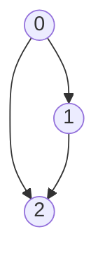

## はじめに
幅優先探索を行う際

- 入次数が2以上の頂点を持つグラフが対象
- その頂点の親を先にQueueに入れて処理する

といった条件下では誤った実装をしてしまうとTLEになりかねないことを学びました。
具体的な実装は後述していますが、Queueから取り出した頂点に対して一手で到達できる頂点を「行ったこと」にするのではなく、取り出した頂点自体を「行ったこと」にする実装をしてしまうとQueueに不要な頂点が溜まっていき計算量が膨大になります。


TLE例（悔しい）
https://atcoder.jp/contests/abc272/submissions/35511194


## 具体例



上記のようなグラフを始点を0として幅優先探索してみます。

グラフは共通して以下のような二次元配列の形式で表現します。

```ruby
G = [
  [1, 2],
  [2],
  []
]
```

### 誤った実装
