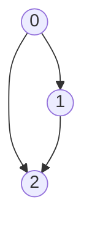

## はじめに
幅優先探索を行う際

- 入次数が2以上の頂点を持つグラフが対象
- その頂点の親を先にQueueに入れて処理する

といった条件下では誤った実装をしてしまうとTLEになりかねないことを学びました。
具体的な実装は後述していますが、Queueから取り出した頂点に対して一手で到達できる頂点を「行ったこと」にするのではなく、取り出した頂点自体を「行ったこと」にする実装をしてしまうとQueueに不要な頂点が溜まっていき計算量が膨大になります。


TLE例（悔しい）
https://atcoder.jp/contests/abc272/submissions/35511194


## 具体例
次のようなグラフを始点を0として幅優先探索してみます。



誤った実装・正しい実装ともに共通して以下のようなオブジェクトを使用します。

- グラフは二次元配列の形式で表現
- 各頂点(0,1,2)を調べたかどうかを長さ3の配列で表現
- 次に調べる頂点の群をキューに入れる（初期値は0）

```ruby
# グラフ
G = [
  [1, 2],
  [2],
  []
]

# その頂点に行ったかどうか
been = Array.new(3, false)

# 最初の頂点
queue = [0]
```

また、Ruby使用者以外の説明として
`queue.shift`とすることでキューの先頭にある値を取り出し、`queue << 1` とすることでキューの後ろに新たに値を追加することができます。

### 誤った実装

```ruby
# キューが空になるまで前から取り出す
while (v = queue.shift) != nil
  been[v] = true

  G[v].each do |v_next|
    # 既に頂点に到達していたらスキップ
    next if been[v_next] == true

    # been[v_next] = true
    # キューの後ろに追加
    queue << v_next

  end
end
```

こちらが誤った実装になります。
`been[v] = true`の部分を見るとわかる通り、キューから取り出した頂点を「行ったこと」にしていることがわかります。

試しにキューに入っている値・繰り返しの回数を調べてみます。


```ruby
count = 0
while (v = queue.shift) != nil
  count += 1 
  been[v] = true

  G[v].each do |v_next|
    next if been[v_next] == true

    # been[v_next] = true
    queue << v_next
  end
    # キューに入る値をチェック
    p queue
end

p count
```

```
# 実行結果
=> 
[1, 2]
[2, 2]
[2]
[]
4 # 繰り返しの回数
```


1. 0をキューから取り出して行ったことにする
2. （まだ行ってなくて）0から一手で到達できる1,2をキューに入れる
3. 1をキューから取り出して行ったことにする
1. （まだ行ってなくて）1から一手で到達できる2をキューに入れる（ここで二個目の2が入ってしまう！！）
1. （まだ行ってなくて）2から 一手で到達できるものはないのでスキップ
1. （まだ行ってなくて）2から 一手で到達できるものはないのでスキップ


といった処理が行われているため、2が無駄にキューに入ってきています。
これを回避するためには次のような処理をすると良さそうです。


1. 0をキューから取り出す
2. （まだ行ってなくて）0から一手で到達できる頂点1,2を行ったことにしてキューに入れる
3. 1をキューから取り出す
1. （まだ行ってなくて）1から一手で到達できる頂点はないので終了！

無駄な計算が減りましたね。これを実装すると次のようになります。

### 正しい実装

```ruby
# 最初の頂点は行ったことにしておく
been[0] = true

# キューが空になるまで前から取り出す
count = 0
while (v = queue.shift) != nil
  count += 1
  # been[v] = true

  G[v].each do |v_next|
    # 既に頂点に到達していたらスキップ
    next if been[v_next] == true

    been[v_next] = true
    # キューの後ろに追加
    queue << v_next

  end
  p queue
end

p count
```

```
# 実行結果
=> 
[1, 2]
[2]
[]
3 # 繰り返しの回数
```

無駄な繰り返し処理が減っていますね。めでたしめでたし。

## 最後に
このように、「既に探索を行った」を行ったとするロジックを入れる場所によっては計算量が膨大になってしまうことがわかりました。例では1回しか繰り返しの処理回数が増えていませんが、グラフが大きくなるとこの実装ミスにより計算量は大幅に変わります。

実際、冒頭にあげたTLEの例ですがやはり正しい実装にするとACすることからも理解できるでしょう。

https://atcoder.jp/contests/abc272/submissions/35524312


また、本記事では行ったことがあるかどうかを表すためにbeenという配列を使用していました。

しかし「何手で到達したか」を表す配列を使用した場合、必然的にキューから取り出した頂点から一手で到達できる頂点を埋めるので今回のような失敗は無くなります。（こっちの方がいいかも）

実装例

```ruby
G = [
  [1, 2],
  [2],
  []
]

# 何手で到達できたか
dist = Array.new(3, -1)

# 最初の頂点
queue = [0]
dist[0] = 0

# キューが空になるまで前から取り出す
while (v = queue.shift) != nil

  G[v].each do |v_next|
    # 既に頂点に到達していたらスキップ
    next if dist[v_next] != -1

    # 親の頂点に到達した手 + 1
    dist[v_next] = dist[v] + 1
    # キューの後ろに追加
    queue << v_next
  end
end
```
